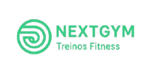

<p align="center">
  
</p>

# NextGym

Site institucional e funcional de uma academia ficticia, desenvolvido com foco em usabilidade, prevencao de erros, feedback ao usuario e acessibilidade.

O projeto permite que o usuario realize tarefas principais de forma clara, rapida e intuitiva, como consultar planos, conhecer modalidades, visualizar horarios e agendar uma aula experimental.

---

## Objetivo do projeto

O objetivo da NextGym e oferecer uma interface simples e eficiente para que o usuario possa:

- visualizar os planos da academia;
- conhecer as modalidades disponiveis;
- consultar horarios de aulas;
- agendar uma aula experimental;
- entrar em contato com a academia.

Alem da parte visual, o projeto foi desenvolvido com foco em criterios de IHC, usabilidade e acessibilidade.

---

## Publico-alvo

O site foi pensado para:

- jovens e adultos;
- pessoas interessadas em saude, bem-estar e condicionamento fisico;
- usuarios iniciantes que precisam de informacoes claras;
- usuarios que acessam tanto por computador quanto por celular;
- usuarios que dependem de recursos de acessibilidade, como teclado, alto contraste, leitores de tela ou Libras.

---

## Funcionalidades

O site conta com as seguintes funcionalidades:

- menu de navegacao responsivo;
- secao inicial com chamada principal;
- exibicao de planos da academia;
- apresentacao das modalidades;
- filtro de horarios por modalidade;
- formulario de aula experimental;
- validacao de campos obrigatorios;
- mensagens de erro e sucesso;
- feedback visual durante o envio do formulario;
- secao de contato;
- link "Pular para o conteudo principal" para navegacao por teclado;
- assistente lateral de acessibilidade com aumento de texto, alto contraste e reducao de movimento;
- integracao com o widget oficial VLibras para traducao de conteudo em Libras;
- uso de ARIA para menu, filtros, formulario, mensagens e pagina atual.

---

## Acessibilidade

Para a proxima entrega, o projeto inclui recursos voltados a acessibilidade e inclusao digital.

### Recursos implementados

| Recurso | Descricao |
| --- | --- |
| HTML semantico | Uso de `header`, `nav`, `main`, `section`, `article` e hierarquia de titulos. |
| VLibras Widget API | Integracao com o script oficial `https://vlibras.gov.br/app/vlibras-plugin.js`, adicionando traducao automatica de Portugues para Libras com avatar 3D. |
| ARIA | Uso de `aria-label`, `aria-controls`, `aria-expanded`, `aria-current`, `aria-pressed`, `aria-invalid`, `aria-describedby` e `aria-live`. |
| Web Storage API | O `localStorage` salva as preferencias do assistente lateral de acessibilidade. |
| Accessibility Tree | HTML semantico e ARIA ajudam o navegador a expor a interface para leitores de tela. |
| Navegacao por teclado | Link de salto para o conteudo, foco visivel e fechamento do menu com `Esc`. |
| Formulario acessivel | Erros ficam associados aos campos e sao anunciados pela area de status. |
| Preferencias visuais | Alto contraste, texto maior, reducao de movimento e suporte a `prefers-reduced-motion`. |

### APIs e tecnologias de acessibilidade

- **VLibras Widget API:** adiciona um recurso lateral de traducao em Libras.
- **Web Storage API:** salva as preferencias do usuario no navegador.
- **ARIA:** melhora a comunicacao entre a interface e tecnologias assistivas.
- **CSS `prefers-reduced-motion`:** respeita usuarios que preferem reduzir animacoes e transicoes.

---

## Avaliacao heuristica

A avaliacao heuristica e uma tecnica de IHC usada para revisar uma interface com base em boas praticas de usabilidade. No NextGym, ela foi aplicada como documentacao do projeto, sem aparecer como uma pagina do site, para manter a experiencia final mais profissional.

### Criterios avaliados

| Heuristica | Como foi aplicada no NextGym |
| --- | --- |
| Visibilidade do status do sistema | O formulario informa erros, envio em andamento e confirmacao de sucesso. |
| Correspondencia com o mundo real | Os textos usam termos comuns ao publico de academia, como planos, modalidades, horarios e aula experimental. |
| Controle e liberdade do usuario | O menu pode ser aberto e fechado, links fecham o menu no mobile e a tecla `Esc` encerra menus abertos. |
| Consistencia e padronizacao | Todas as paginas usam o mesmo cabecalho, rodape, botoes, cards e estrutura visual. |
| Prevencao de erros | O formulario valida campos obrigatorios, e-mail e telefone antes de simular o envio. |
| Reconhecimento em vez de memorizacao | As opcoes principais ficam visiveis no menu e os filtros de horarios apresentam modalidades claramente identificadas. |
| Flexibilidade e eficiencia de uso | O site funciona em desktop e mobile, possui filtros de horarios e permite navegacao por teclado. |
| Design estetico e minimalista | A interface prioriza informacoes essenciais, com secoes objetivas e chamadas diretas. |
| Ajuda no reconhecimento e recuperacao de erros | Cada campo invalido recebe mensagem especifica associada ao proprio input. |
| Acessibilidade | O site inclui foco visivel, link de salto, ARIA, assistente lateral, alto contraste, texto maior, reducao de movimento e VLibras. |

### Problemas encontrados e melhorias realizadas

| Problema identificado | Melhoria aplicada |
| --- | --- |
| Menu mobile nao informava seu estado para tecnologias assistivas. | Foram adicionados `aria-controls`, `aria-expanded` e mudanca dinamica do `aria-label`. |
| Filtros de horarios nao comunicavam qual opcao estava ativa. | Os botoes passaram a usar `aria-pressed`. |
| Erros do formulario eram apenas visuais. | Campos receberam `aria-invalid`, `aria-describedby` e mensagens associadas. |
| Nao havia atalho para pular o menu. | Foi incluido o link "Pular para o conteudo principal". |
| Nao havia recurso dedicado a usuarios surdos. | Foi integrado o VLibras Widget API para traducao em Libras. |
| Preferencias visuais nao eram personalizaveis. | Foi criado um assistente lateral com texto maior, alto contraste e reducao de movimento. |

### Conclusao

A avaliacao indica que o site atende aos principais criterios de usabilidade esperados para a proposta academica. As melhorias implementadas reforcam acessibilidade, prevencao de erros, feedback ao usuario e consistencia visual, mantendo o site com aparencia de produto real.

---

## Estrutura do projeto

```bash
nextgym/
|
|-- index.html
|-- planos.html
|-- modalidades.html
|-- horarios.html
|-- aula.html
|-- contato.html
|
|-- css/
|   |-- style.css
|
|-- js/
|   |-- script.js
|
|-- img/
|   |-- logo-nextgym.png
|   |-- icone-acessibilidade.svg
```
